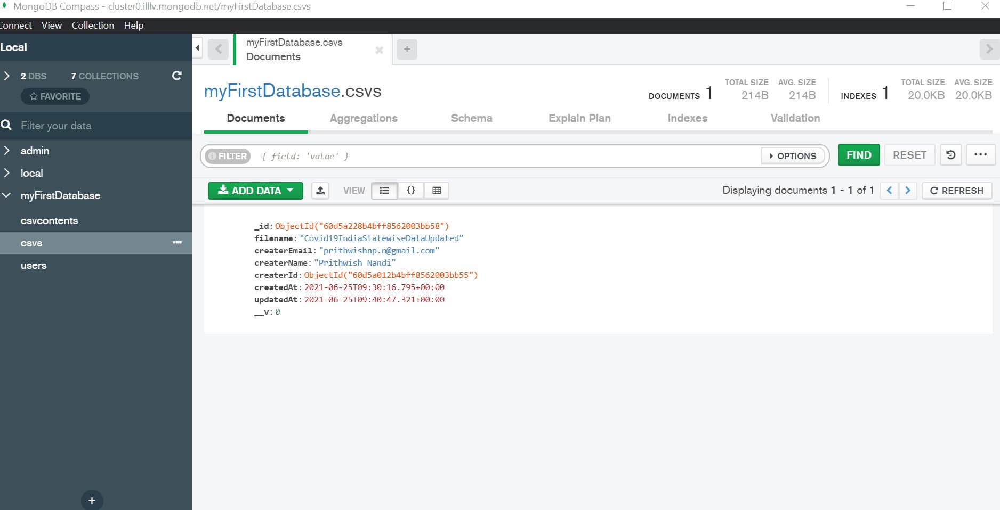
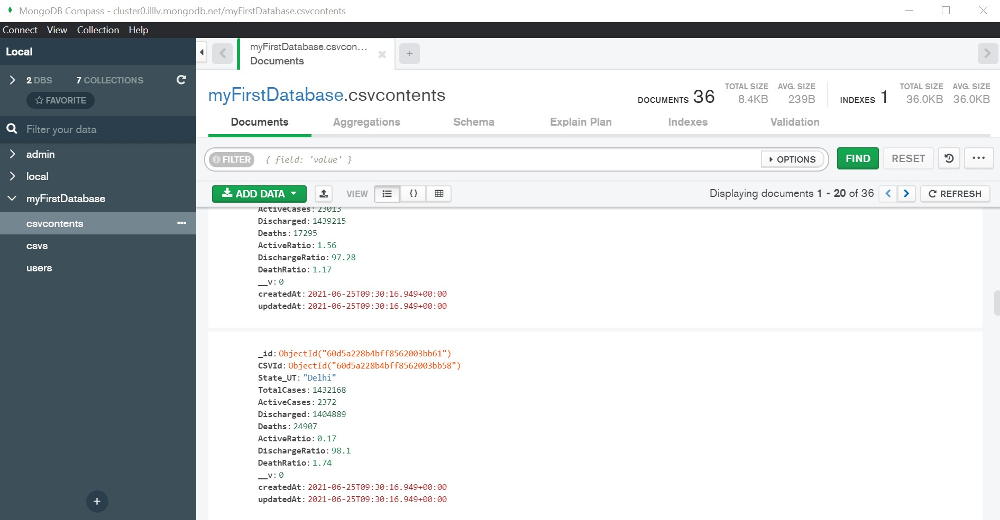

# CSVCrudTask1
<b> A repo of CSV CRUD API for Internship Interview Task1 using Node.js, Express.js and MongoDB </b> <br><br>
<b> This API takes a CSV file from form multipart and after that it is parsed and contents are mapped to mongoose collection and upon that mongoose collection CRUD operation is performed. Also Every Route (Except ('/') ) is protected through authentication token middleware thus User needs to first SignUp/SignIn to use </b>
<br>
<br>
<h3> The API is also Deployed to Heroku :- https://csvcrudtask.herokuapp.com/ </h3>
<b> the MongoDB Atlas is used for storing the data </b>
<br>
<h4> To Run the API in Local machine </h4>

```bash
   $ git clone the above repo OR git clone https://github.com/PnCodeBreaker/CSVCrudTask1.git
   $ cd to the directory and cd to backend_api
   $ npm install ( node.js must be installed )
   $ ENV FILE needs to be Set Up
   $ Two ENV variables are used :-
   $ SECRET (JWT SECRET) and CONNECTION_URL (For mongoDB connection either use localmongoDB or MongoDB Atlas)
   $ use nodemon to start the API OR use node index.js
```
<br>
<h4> Note :- </h4>
 Sample CSV File Used is in the folder sample_csv_file folder, It is downloaded from Kaggle (https://www.kaggle.com/anandhuh/latest-covid19-india-statewise-data)
 and the mongoDB collection and document Schema are defined according to its header file/data content from the parsed CSV file ( <em>csvtojson</em> package is used ).

## How to use the API with PostMan with ScreenShots 
<ul> <li> Two PostMan Collections are created in the postman_collection folder, one for LocalHost use and other for Heroku Deployed Link use </li>
   <li> Import Either of them, a detailed description is given in postman_collection as well </li>
   <h4> Routes that are used in the API:- </h4>
       <p> <b> Routes :- ( Either Use localhost:5000/ or https://csvcrudtask.herokuapp.com/ ) <br>
          Note:-  :id params needed to be changed manually for testing the api in PostMan. </b> </p>
      
<li> ('/') (GET) - Only Route that is not authenticated and it just displays the api is running. </li> <br>

<li> ('/user/signup') - for signup, authentication and generating jwt token for the protected routes auth middleware. </li>
   
<br><br>
<li> ('/user/signin') - for signin in the user, authenticaion and generating jwt token for the protected routes auth. </li> <br>
<li> ('/user/signout') - for signout ( only possible in cookie based, not possible if bearer token auth is used). </li> <br>
<li> ('/home')  (GET) (protected route) -  for fetching the CSVFILE MetaData ( not actual contents inside CSV file). but filename, userId etc and it fetches all the CSVFIles uploaded by the current authorized user.  </li>
   
<br><br>
<li> ('/home') (POST) (protected route) - it posts the csv file and its contents and pushes to mongodb. </li>

   <br><br>
<li> ('/home/update/:id') (PATCH) (protected route) - This  will update the CSV file meta Data 
   ( not actual contents inside csv ) of a given ID created by the current authenticated user. </li>

 <br><br>  
<li> ('/home/delete/:id) (DELETE) (protected route) - This will delete the CSV 
   file meta Data provided its id in params and all contents in CSV as well  </li>
<br>
<li> ('/home/csvdata/:csvId') (GET) (protected route) - This will fetch all the CSV Contents/Data inside 
   the provided CSVFile whose ID is provided in params </li>
      
   <br><br>
 <li> ('/home/csvdata/:csvId') (POST) (protected route) -This will create a new CSV Content/Data inside 
    the provided CSVFile whose ID is provided in params </li>
      
   <br><br>
 <li> ('/home/csvdata/update/:csvContentId') (PATCH) (protected route) - This will update a CSV Content/Data inside 
    the provided CSVFile whose ID is provided in params </li> 
<br>
<li> ('/home/csvdata/delete/:csvContentId') (DELETE) (protected route) - This will delete a CSV Content/Data inside 
   the provided CSVFile whose ID is provided in params </li>
</ul>
<br><br>
<h3> MongoDB Compass Screenshot:- </h3>

<br><br>

